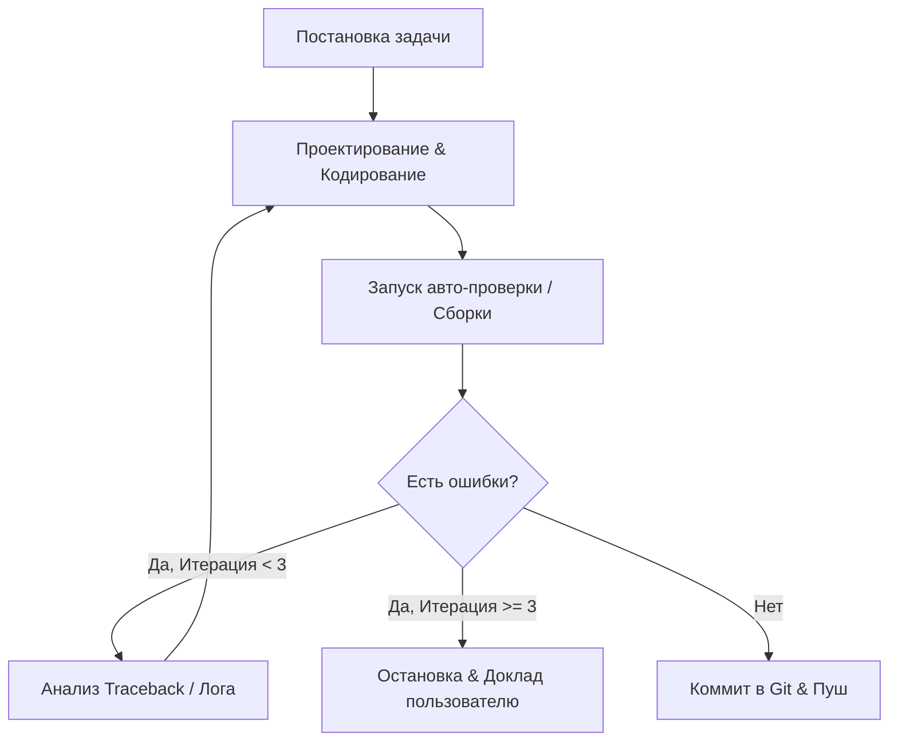

# Скилл: Инжиниринг циклов (Loop Engineering)

Этот скилл регламентирует автономное поведение агента при выполнении задач кодирования и исправления багов с использованием замкнутого цикла обратной связи (Feedback Loop) без привлечения пользователя на промежуточных этапах.

## 1. Архитектура цикла (Reason-Act-Observe)

Каждое изменение кода должно проходить строго регламентированный цикл:

## 2. Шаги исполнения

### Шаг 1. Анализ и Локализация (Reason)
- Прочесть файлы проекта, связанные с багом или фичей.
- Найти место возникновения проблемы.

### Шаг 2. Внесение изменений (Act)
- Изменить код с использованием инструментов `replace_file_content` или `write_to_file`.
- Не запрашивать промежуточное одобрение у пользователя во время выполнения цикла, если команда "кодируй" уже была дана.

### Шаг 3. Верификация (Observe)
После любого изменения кода агент **обязан** запустить соответствующую команду проверки:
- Для Python/конфигураций: `ruff check .`
- Для Next.js/React: `npm run build` или запуск локальных тестов.
- Агент должен прочитать вывод терминала (stdout/stderr).

### Шаг 4. Самоисправление (Self-Correction)
- **Лимит:** Максимум 3 цикла авто-исправления.
- Если сборка/линтер упали, проанализировать ошибку и внести исправление (возврат к Шагу 2).
- Если после 3-й попытки исправить ошибку не удалось, немедленно прервать цикл, описать проблему пользователю и приложить логи ошибок.

### Шаг 5. Фиксация результата
- После успешной сборки и отсутствия ошибок линтера зафиксировать изменения:
  1. Сделать коммит в Git с описанием изменений.
  2. Сделать push в ветку.
  3. Написать итоговый отчет (`walkthrough.md`) для пользователя.
