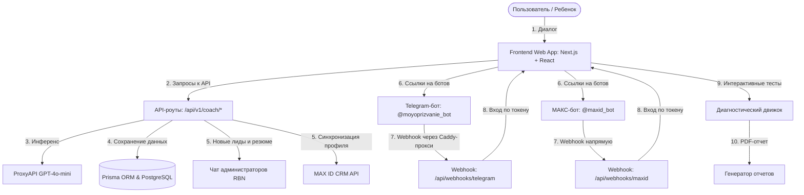

# Системная архитектура платформы «МоёПризвание»

Архитектура платформы построена на принципах модульности, высокой скорости отклика интерфейса и бесшовного пользовательского опыта. Настоящий документ детально описывает интеграционные шлюзы, сетевое проксирование и логику обмена данными между компонентами.

---

## 1. Схема взаимодействия компонентов



---

## 2. Сценарий Нейрокоуча Романа (`/coach`)

- **Интерфейс**: Чат-интерфейс с поддержкой плавных микровзаимодействий, анимаций сообщений (Framer Motion) и клавиатурного управления (выход по кнопке `Escape`).
- **Бэкенд-обработка (`/api/v1/coach/chat`)**: 
  - Формирует историю транскрипта и сохраняет её в таблицу `coach_sessions`.
  - При первой инициализации возвращает фиксированное приветствие коуча без вызова ИИ, что экономит токены и гарантирует мгновенный старт.
  - Направляет запросы к модели через `ProxyAPI` под маской наставника **Романа** с жестким запретом на упоминание ИИ, роботов и языковых моделей.
  - В системный промт внедрено строгое ограничение против дублирования и эхо-повторения фраз пользователя.

---

## 3. Экстрактор данных и интеграции (`/api/v1/coach/extract`)

Экстрактор работает на лету на каждом шаге диалога, анализируя сообщения пользователя:
- **Нативная регистрация (Этап 1)**: Выделяет имя, роль (STUDENT / PARENT), класс, возраст, город и телефон. Обновляет профиль `User` в БД.
- **Качественные показатели (Этапы 2-5)**: Выделяет мечты, интересы, достижения, кумиров, ценности, мотивацию, сильные стороны, стиль мышления/общения.
- **Событийные триггеры**:
  1. **При регистрации телефона**: Мгновенно отправляет карточку лида в Telegram-администратора и систему MAX ID.
  2. **При завершении (Этап 6)**: Записывает эмпатичное резюме Романа в поле `preliminaryFeedback` и осуществляет полную выгрузку профиля в Telegram и MAX ID. Также отправляет готовое резюме пользователю лично в чат-боты.

---

## 4. Интеграционные шлюзы и авторизация

### Telegram API и обход блокировок (Caddy-проксирование)

- **Проблема с блокировкой**: Запросы со стейджинг-сервера (из РФ) к `api.telegram.org` блокируются или завершаются по таймауту.
- **Решение (Проксирование через Бастион)**: 
  - На американском сервере-бастионе (`37.1.212.51`) в Caddyfile настроен обратный прокси для всех запросов на домен Telegram.
  - Конфигурация в Caddy:
    ```caddy
    handle /tg-bot/* {
        uri strip_prefix /tg-bot
        reverse_proxy https://api.telegram.org {
            header_up Host api.telegram.org
        }
    }
    ```
  - Переменная окружения `TELEGRAM_API_BASE_URL` на стейджинг-сервере настроена на `http://37.1.212.51/tg-bot`. 
  - Все исходящие вызовы API (отправка сообщений, регистрация вебхука) отправляются на бастион, который перенаправляет их на оригинальный API Telegram.

- **Схема авторизации**:
  1. Пользователь нажимает кнопку «Поделиться контактом» в `@moyoprizvanie_bot`.
  2. Вебхук `/api/webhooks/telegram` принимает POST-запрос с объектом контакта.
  3. Бэкенд сопоставляет номер, генерирует сессионный токен Better Auth и создает запись в таблице `session`.
  4. Пользователю отправляется инлайн-кнопка со ссылкой: `https://synthosai.ru/api/auth/telegram/callback?token={token}`.

**Пример POST-запроса от Telegram Webhook (вход по контакту):**
```json
{
  "update_id": 987654321,
  "message": {
    "message_id": 42,
    "from": {
      "id": 12345678,
      "is_bot": false,
      "first_name": "Иван"
    },
    "chat": {
      "id": 12345678,
      "type": "private"
    },
    "date": 1719750000,
    "contact": {
      "phone_number": "79991234567",
      "first_name": "Иван",
      "user_id": 12345678
    }
  }
}
```

---

### Мессенджер МАКС (MAX Bot API)

- **Базовый API**: МАКС использует платформу на базе протокола TamTam API. Основной эндпоинт для запросов: `https://platform-api2.max.ru`.
- **Авторизация запросов**: Запросы к API МАКС выполняются с передачей токена бота в заголовке `Authorization` (чистый токен из переменной `MAXID_BOT_TOKEN`, без префиксов).
- **Прием контакта (vCard)**:
  - Бот `@maxid_bot` предлагает поделиться контактом через клавиатурную кнопку с типом `request_contact`.
  - При отправке контакта на вебхук `/api/webhooks/maxid` приходит событие `message_created` с массивом вложений (`attachments`).
  - Объект контакта имеет `type: "contact"`, а номер телефона запакован в формате vCard внутри поля `payload.vcf_info`.
  - Извлечение телефона на бэкенде производится с помощью регулярного выражения: `/TEL;[^:]*:([^\n\r]+)/i`.

**Пример POST-запроса от вебхука МАКС (контакт vCard):**
```json
{
  "update_type": "message_created",
  "timestamp": 1719750000000,
  "message": {
    "mid": "mid.123456789abcdef",
    "seq": 100,
    "sender": {
      "user_id": 87654321,
      "name": "Иван Петров"
    },
    "recipient": {
      "chat_id": 87654321
    },
    "body": {
      "text": "",
      "attachments": [
        {
          "type": "contact",
          "payload": {
            "vcf_info": "BEGIN:VCARD\nVERSION:3.0\nN:Petrov;Ivan;;;\nFN:Ivan Petrov\nTEL;TYPE=CELL,VOICE,PREF:+79991234567\nEND:VCARD"
          }
        }
      ]
    }
  }
}
```

**Решение для парсинга номера в TypeScript:**
```typescript
const contactAttachment = message.attachments.find((att: any) => att.type === 'contact');
if (contactAttachment && contactAttachment.payload?.vcf_info) {
  const vcard = contactAttachment.payload.vcf_info;
  const phoneMatch = vcard.match(/TEL;[^:]*:([^\n\r]+)/i);
  if (phoneMatch) {
    const rawPhone = phoneMatch[1].trim(); // "+79991234567"
  }
}
```

---

### MAX ID API (Leads CRM Sync)

- **Синхронизация**: Интеграция по токену `maxToken` в единую систему цифровых профилей.
- **Эндпоинт**: `https://api.maxid.ru/v1/leads`
- **Метод**: `POST`
- **Передаваемые данные**: Системные контакты + метаданные коуч-сессии (мечты, ценности, барьеры, резюме коуча).
