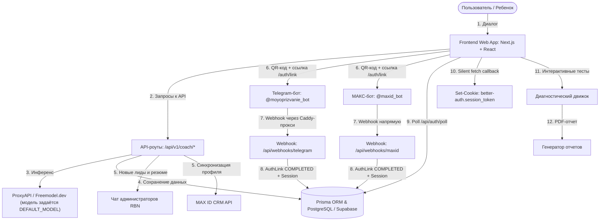
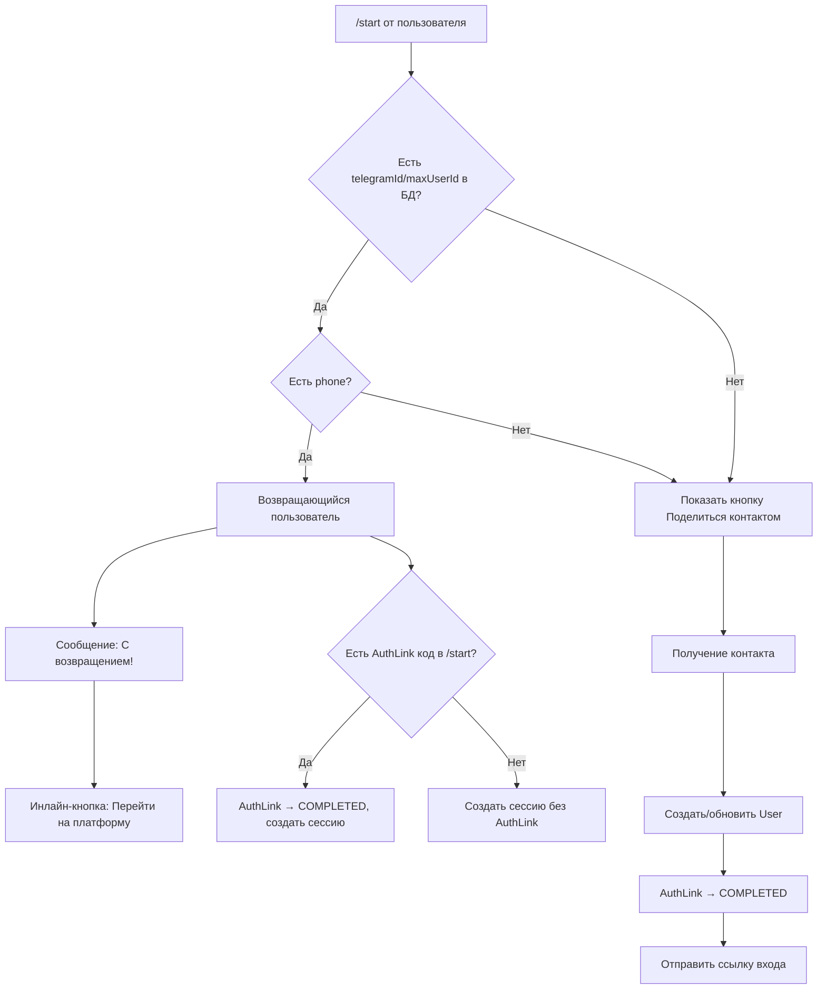

# Системная архитектура платформы «МоёПризвание»

Архитектура платформы построена на принципах модульности, высокой скорости отклика интерфейса и бесшовного пользовательского опыта. Настоящий документ детально описывает интеграционные шлюзы, сетевое проксирование и логику обмена данными между компонентами.

---

## 1. Схема взаимодействия компонентов



---

## 2. Сценарий Нейрокоуча Романа (`/coach`)

- **Интерфейс**: Чат-интерфейс с поддержкой плавных микровзаимодействий, анимаций сообщений (Framer Motion) и клавиатурного управления (выход по кнопке `Escape`).
- **Прогресс-бар**: Отображает текущий шаг сессии и процент завершения. Шкала —
  **0-22** (не 0-6), с двумя режимами после сбора личных данных:
  - **EXPRESS** — шаги 0-16, свободный диалог по 15 психологическим блокам
    (хобби, школа, мечты (WOOP), кумиры, родители, страхи, опыт, формат работы,
    мышление, мерило успеха, энергия, командная роль, ценности), шаг 16 —
    подведение итогов.
  - **DEEP** — шаги 0-15 те же, затем шаги 16-22 — воронка по пирамиде Дилтса:
    цель → результат → эмоциональный отклик → идентичность → план → первый
    микро-шаг → итоги. Режим выбирается пользователем после заполнения личных
    данных (`sessionMode: 'EXPRESS' | 'DEEP'`).
  - Полный список имён шагов — `STEP_NAMES` в `app/coach/page.tsx`.
- **Бэкенд-обработка (`/api/v1/coach/chat`)**:
  - Формирует историю транскрипта и сохраняет её в таблицу `coach_sessions`.
  - При первой инициализации возвращает фиксированное приветствие коуча без вызова ИИ, что экономит токены и гарантирует мгновенный старт.
  - Направляет запросы к модели через `ProxyAPI` под маской наставника **Романа** с жестким запретом на упоминание ИИ, роботов и языковых моделей.
  - В системный промт внедрено строгое ограничение против дублирования и эхо-повторения фраз пользователя.
  - Шаги 18 (эмоциональный отклик) и 19 (идентичность) в DEEP-режиме используют
    конкретные проективные формулировки (сравнение с телесным откликом, «какой
    герой/персонаж») вместо абстрактных вопросов «что ты чувствуешь» / «кто
    ты» — подросткам 13-16 лет с ещё не сформированным формально-логическим
    мышлением такие вопросы часто дают ступор или шаблонный ответ.

### Порядок шагов и перескоки (актуальная шкала 0-22)

| Шаг | Название | Режим |
|-----|----------|-------|
| 0 | Знакомство и контракт | оба |
| 1 | Знакомство (Имя) | оба |
| 2 | Подключение канала связи | оба (пропускается, если телефон уже в БД) |
| 3 | Увлечения и хобби | оба |
| 4 | Школа и предметы | оба |
| 5 | Мечты и цели (WOOP) | оба |
| 6 | Вдохновители и авторитеты | оба |
| 7 | Родители и влияние | оба |
| 8 | Страхи и барьеры | оба |
| 9 | Практический опыт | оба |
| 10 | Желаемый формат работы | оба |
| 11 | Тип мышления | оба |
| 12 | Мерило успеха | оба |
| 13 | Источники энергии | оба |
| 14 | Командная роль | оба |
| 15 | Ценности и автономия | оба |
| 16 | Подведение итогов (EXPRESS) / Глубинная цель — запрос (DEEP) | ветвление |
| 17 | Желаемый результат | только DEEP |
| 18 | Эмоциональный отклик | только DEEP |
| 19 | Новая идентичность | только DEEP |
| 20 | План действий | только DEEP |
| 21 | Первый микро-шаг | только DEEP |
| 22 | Подведение итогов наставника | только DEEP |

---

## 3. Экстрактор данных и интеграции (`/api/v1/coach/chat`)

Экстрактор работает на лету на каждом шаге диалога, анализируя сообщения пользователя через отдельный запрос к языковой модели (ProxyAPI / Freemodel.dev; конкретная модель задаётся `DEFAULT_MODEL` в `app/lib/gemini.ts` — на 19.07.2026 это `gpt-5.5`, см. INC-005) с промтом-экстрактором:

- **Этап 1 (Знакомство)**: Выделяет имя (`fullName`) и возраст (`age`). Обновляет профиль `User` в БД.
- **Этап 2 (Канал связи)**: При подтверждении через бота — получает `phone` из webhook. При вводе в чат — извлекает `phone` регулярным выражением.
- **Этапы 3-5 (Качественные показатели)**: Выделяет `city`, `grade`, `dreams`, `interests`, `achievements`, `idols`, `values`, `motivation`, `strengths`, `weaknesses`, `cognitiveStyle`, `decisionStyle`, `communicationStyle`, `hypotheses`.
- **Событийные триггеры**:
  1. **При подтверждении телефона**: Мгновенно отправляет карточку лида в Telegram-администратора и систему MAX ID.
  2. **При завершении (Этап 6)**: Записывает эмпатичное резюме Романа в поле `preliminaryFeedback` и осуществляет полную выгрузку профиля в Telegram и MAX ID. Также отправляет готовое резюме пользователю лично в чат-боты.

---

## 4. Интеграционные шлюзы и авторизация

### Telegram API и обход блокировок (Caddy-проксирование)

- **Проблема с блокировкой**: Запросы со стейджинг-сервера (из РФ) к `api.telegram.org` блокируются или завершаются по таймауту.
- **Решение (Проксирование через Бастион)**: 
  - На американском сервере-бастионе (`37.1.212.51`) в Caddyfile настроен обратный прокси для всех запросов на домен Telegram.
  - Конфигурация в Caddy:
    ```caddy
    handle /tg-bot/* {
        uri strip_prefix /tg-bot
        reverse_proxy https://api.telegram.org {
            header_up Host api.telegram.org
        }
    }
    ```
  - Переменная окружения `TELEGRAM_API_BASE_URL` на стейджинг-сервере настроена на `http://37.1.212.51/tg-bot`. 
  - Все исходящие вызовы API (отправка сообщений, регистрация вебхука) отправляются на бастион, который перенаправляет их на оригинальный API Telegram.

### Схема авторизации через AuthLink

```mermaid
sequenceDiagram
    participant U as Пользователь (браузер)
    participant C as Coach Page
    participant API as /api/auth/link-code
    participant Link as /auth/link
    participant Bot as Telegram/MAX Бот
    participant WH as Webhook
    participant Poll as /api/auth/poll
    participant CB as /api/auth/telegram/callback

    U->>C: Начинает коуч-сессию
    C->>API: POST /api/auth/link-code
    API-->>C: { code: "abc123" }
    Note over C: QR-код и кнопки TG/MAX генерируются с кодом
    U->>Link: Нажимает кнопку "Telegram"
    Link->>Bot: Открывает бота с ?start=abc123
    Bot->>U: "Поделиться контактом"
    U->>Bot: Отправляет контакт
    Bot->>WH: POST webhook с контактом
    WH->>WH: Парсит телефон, создаёт User/Session
    WH->>WH: AuthLink.status = COMPLETED
    
    loop Каждые 2 секунды
        C->>Poll: GET /api/auth/poll?code=abc123
        Poll-->>C: { status: "COMPLETED", sessionToken: "..." }
    end
    
    C->>CB: Silent fetch (redirect: manual, credentials: include)
    CB-->>C: Set-Cookie: better-auth.session_token
    C->>C: Отправляет "Телефон подтвержден через бот"
    C->>C: Перескок на Шаг 3
```

### Мессенджер МАКС (MAX Bot API)

- **Базовый API**: МАКС использует платформу на базе протокола TamTam API. Основной эндпоинт для запросов: `https://platform-api2.max.ru`.
- **Авторизация запросов**: Запросы к API МАКС выполняются с передачей токена бота в заголовке `Authorization` (чистый токен из переменной `MAXID_BOT_TOKEN`, без префиксов).
- **Прием контакта (vCard)**:
  - Бот `@maxid_bot` предлагает поделиться контактом через клавиатурную кнопку с типом `request_contact`.
  - При отправке контакта на вебхук `/api/webhooks/maxid` приходит событие `message_created` с массивом вложений (`attachments`).
  - Объект контакта имеет `type: "contact"`, а номер телефона запакован в формате vCard внутри поля `payload.vcf_info`.
  - Извлечение телефона на бэкенде производится с помощью регулярного выражения: `/TEL;[^:]*:([^\n\r]+)/i`.

**Пример POST-запроса от вебхука МАКС (контакт vCard):**
```json
{
  "update_type": "message_created",
  "timestamp": 1719750000000,
  "message": {
    "mid": "mid.123456789abcdef",
    "seq": 100,
    "sender": {
      "user_id": 87654321,
      "name": "Иван Петров"
    },
    "recipient": {
      "chat_id": 87654321
    },
    "body": {
      "text": "",
      "attachments": [
        {
          "type": "contact",
          "payload": {
            "vcf_info": "BEGIN:VCARD\nVERSION:3.0\nN:Petrov;Ivan;;;\nFN:Ivan Petrov\nTEL;TYPE=CELL,VOICE,PREF:+79991234567\nEND:VCARD"
          }
        }
      ]
    }
  }
}
```

---

### Логика возвращающихся пользователей в ботах

Оба бота (Telegram и MAX) реализуют **state-aware** `/start` обработку:



---

### MAX ID API (Leads CRM Sync)

- **Синхронизация**: Интеграция по токену `maxToken` в единую систему цифровых профилей.
- **Эндпоинт**: `https://api.maxid.ru/v1/leads`
- **Метод**: `POST`
- **Передаваемые данные**: Системные контакты + метаданные коуч-сессии (мечты, ценности, барьеры, резюме коуча).

---

## 5. Зависимости и ключевые библиотеки

| Библиотека | Назначение |
|-----------|------------|
| `next` 14.2.5 | Фреймворк (App Router, API Routes, Standalone mode) |
| `prisma` | ORM для PostgreSQL / Supabase |
| `better-auth` | Авторизация и сессии (cookie-based) |
| `framer-motion` | Анимации UI |
| `qrcode.react` | Локальная генерация QR-кодов (SVG) |
| `lucide-react` | Иконки |
| `zustand` | Стейт-менеджмент (диагностика) |

---

## 6. Ключевые файлы проекта

### Бэкенд (API Routes)
| Файл | Назначение |
|------|------------|
| `app/api/v1/coach/chat/route.ts` | Основная логика коуч-сессии: шаги, экстракция, генерация ответа |
| `app/api/webhooks/telegram/route.ts` | Webhook Telegram: обработка /start, контактов, возвращающихся |
| `app/api/webhooks/maxid/route.ts` | Webhook MAX: аналогичная логика для мессенджера МАКС |
| `app/api/auth/link-code/route.ts` | Генерация временных кодов AuthLink |
| `app/api/auth/poll/route.ts` | Поллинг статуса AuthLink |
| `app/api/auth/telegram/callback/route.ts` | Установка cookie сессии и редиректы |

### Фронтенд (Pages)
| Файл | Назначение |
|------|------------|
| `app/page.tsx` | Главная страница (лендинг) |
| `app/coach/page.tsx` | Чат с коучем Романом |
| `app/auth/page.tsx` | Страница входа в ЛК (QR-коды, Telegram-виджет) |
| `app/auth/link/page.tsx` | Страница подключения мессенджера (QR + кнопка) |
| `app/assessment/page.tsx` | Интерактивные тесты |
| `app/report/page.tsx` | Личный кабинет с результатами |
