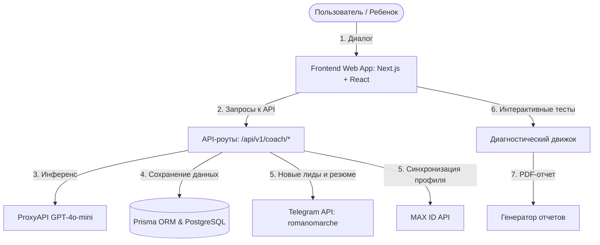

# Системная архитектура платформы «МоёПризвание»

Архитектура построена на принципах модульности, высокой скорости отклика интерфейса и бесшовного пользовательского опыта.

## Схема взаимодействия компонентов

---

## 1. Сценарий Нейрокоуча Романа (`/coach`)
- **Интерфейс**: Чат-интерфейс с поддержкой плавных микровзаимодействий, анимаций сообщений и клавиатурного управления (выход по кнопке `Escape`).
- **Бэкенд-обработка (`/api/v1/coach/chat`)**: 
  - Формирует историю транскрипта.
  - Направляет запросы к модели через `ProxyAPI` под маской наставника **Романа** с жестким запретом на упоминание ИИ, роботов и языковых моделей.
  - Тон общения: искренний, дружелюбный, вовлекающий, адаптирующийся под лексикон ребенка.

---

## 2. Экстрактор данных и интеграции (`/api/v1/coach/extract`)
Экстрактор работает в фоновом режиме на каждом шаге диалога, анализируя сообщения пользователя:
- **Нативная регистрация (Этап 1)**: Выделяет имя, роль (STUDENT / PARENT), класс, возраст, город и телефон. Обновляет профиль `User` в БД.
- **Качественные показатели (Этапы 2-5)**: Выделяет мечты, интересы, достижения, кумиров, ценности, мотивацию, сильные стороны, стиль мышления/общения.
- **Событийные триггеры**:
  1. **При регистрации телефона**: Мгновенно отправляет карточку лида в Telegram-администратора и систему MAX ID.
  2. **При завершении (Этап 6)**: Записывает эмпатичное резюме Романа в поле `preliminaryFeedback` и осуществляет полную выгрузку профиля в Telegram и MAX ID.

---

## 3. Интеграционные шлюзы

### Telegram API
Отправляет уведомления в чат администраторов через бота `romanomarche` (`TELEGRAM_BOT_TOKEN`).
- **События**: Создание лида, заполнение контактов, формирование предварительного вердикта.
- **Формат**: Красиво размеченный Markdown с эмодзи и структурированными блоками данных.

### MAX ID API
Интеграция по токену `maxToken` в единую систему цифровых профилей.
- **Эндпоинт**: `https://api.maxid.ru/v1/leads`
- **Передаваемые данные**: Системные контакты + метаданные коуч-сессии (мечты, ценности, барьеры, резюме коуча).
