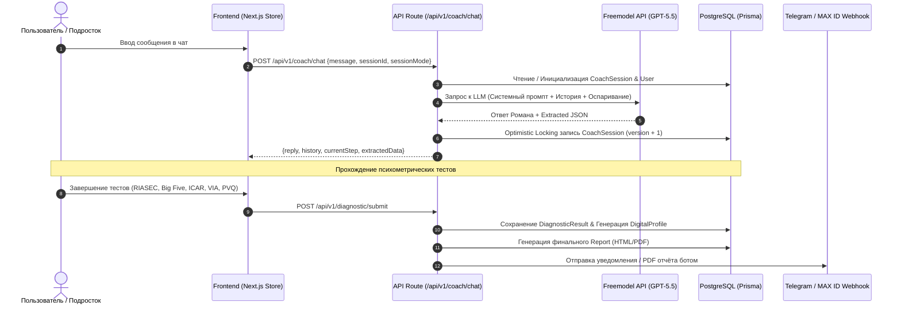

# Детализированный глубокий аудит проекта «МоёПризвание» (v1.1)

**Дата проведения аудита:** 20 июля 2026 г.  
**Объект аудита:** Веб-платформа профориентации и диагностики талантов «МоёПризвание» (Next.js 14 App Router, PostgreSQL, Prisma, Better Auth, Freemodel AI).

---

## 1. Исполнительное резюме (Executive Summary)

Проект **«МоёПризвание»** представляет собой высокотехнологичную экосистему профориентации для подростков (10–17 лет) и их родителей. Продукт объединяет психологический ИИ-коучинг (с персонажем «Роман»), объективную мульти-факторную психометрическую батарею и алгоритмический генератор персонализированных отчетов.

### Ключевые выводы аудита:
1. **Архитектура и код:** Проект построен по современным стандартам Next.js 14 App Router с четким разделением Server/Client компонентов, надёжной защитой от race condition в PostgreSQL через Optimistic Locking (`version`), двухслойной куки-авторизацией Better Auth и системой ротации API-ключей для ИИ.
2. **Дизайн и UX/UI:** Реализована премиальная космическая нео-бруталистическая эстетика (Neo-Glassmorphism, адаптивные видео-фоны, гибкая адаптация под темную и светлую темы, типографическая система Manrope + Prata + Marck Script).
3. **Методология:** Внедрены стандарты Holland RIASEC, Big Five (BFI-10), ICAR (когнитивный тест), VIA Youth Survey (24 силы характера), PVQ Шварца (ценности), шкала прокрастинации Лэя, Пирамида Идентичности Дилтса и детерминированный Индекс Согласованности (Consistency Index).
4. **Потоки данных:** Реализован сквозной пайплайн сбора: анонимный гость → ИИ-диалог → психометрические тесты → агрегация в 7-слойный DigitalProfile → генерация отчета в PDF/HTML → миграция сессии (Soft Merge) → синхронизация с Telegram и MAX ID.

---

## 2. Анализ кодовой базы, архитектуры и логики кода

### 2.1. Технологический стек (Tech Stack)

| Компонент | Технология / Зависимость | Назначение и Оценка |
| :--- | :--- | :--- |
| **Core Framework** | `Next.js 14.2.5` (App Router) | Реактивный SSR/SSG каркас, строгое разделение Server Actions и Client Components. |
| **Language** | `TypeScript 5.5.4` | Полная типизация, отсутствие неконтролируемого `any` в доменной логике. |
| **Database & ORM** | `PostgreSQL` + `Prisma 6.19.3` | Реляционная БД. Авто-подмена порта `:6543` на `:5432` в `env.ts` для обхода зависаний PgBouncer. |
| **Authentication** | `Better Auth 1.6.21` | Двойные signed-cookies (`better-auth.session_token` + `__secure-`), token exchange flow. |
| **AI Integration** | `Freemodel.dev API` (`gpt-5.5`) | `gemini.ts` с перебором резервных ключей (multi-key failover) и экспоненциальным backoff. |
| **Caching & State** | `Redis` (`ioredis 5.4.1`) + `Zustand 5.0` | Сессионный кэш, rate-limiting и клиенский стейт диалогов/тестов. |
| **Styling & Motion** | `TailwindCSS 3.4` + `Framer Motion 12` + `GSAP 3.15` | Скоростная стилизация, анимация интерфейсов и Колеса Талантов. |
| **Logging & Sentry** | `Pino 10.3` + `@sentry/nextjs 10.61` | Изолированное логирование без утечек персональных данных в консоль. |
| **Testing** | `Vitest 4.1` + `Playwright 1.61` + `Axe-Core` | Юнит-тесты методологии и E2E тесты UX/a11y. |

### 2.2. Полный каталог API Эндпоинтов (API Routes Specification)

| Эндпоинт | Метод | Описание и Логика |
| :--- | :--- | :--- |
| `/api/auth/[...all]` | `GET/POST` | Канонический обработчик Better Auth (вход, регистрация, выход, валидация сессий). |
| `/api/auth/link-code` | `POST` | Генерация 6-значного кода привязки `linkCode` для связи гостевой сессии с Telegram/MAX ID. |
| `/api/auth/poll` | `GET` | Поллинг статуса авторизации через QR-код или мессенджер. |
| `/api/auth/progress` | `GET` | Получение серверного статуса прохождения коучинга и тестов (источник правды для интерфейса). |
| `/api/auth/telegram` | `GET/POST` | Коллбэк и валидация Telegram WebApp InitData. |
| `/api/v1/coach/chat` | `POST` | Основной API диалога с Романом (Optimistic Locking, ИИ-экстракция, «Адвокат дьявола»). |
| `/api/v1/diagnostic/submit` | `POST` | Прием ответов психометрических тестов, расчет баллов в `scoring.ts` и сохранение `DiagnosticResult`. |
| `/api/generate-report` | `POST` | Генерация итогового 7-слойного отчета (HTML / PDF) через Puppeteer/Sharp/Freemodel. |
| `/api/webhooks/telegram` | `POST` | Вебхук Telegram-бота (обработка `/start`, кнопка "Поделиться контактом", отправка PDF). |
| `/api/webhooks/maxid` | `POST` | Вебхук интеграции с национальной системой авторизации MAX ID. |
| `/api/cron/notifications` | `GET` | Фоновые напоминания о незавершенных тестах для зарегистрированных пользователей. |

---

## 3. Анализ дизайна, интерфейсов и UX/UI

### 3.1. Визуальная концепция и атмосфера
* **Стиль:** Космический нео-брутализм с элементами Glassmorphism (темный космический фон, полупрозрачные карточки с `backdrop-blur`, свечение неоновых градиентов).
* **Типографическая система:**
  * `Manrope` (Variable) — основной гротеск для читабельных текстов и кнопок.
  * `Prata` (Serif) — премиальные акцентные заголовки блоков и карточек.
  * `Marck Script` — имитация живого почерка наставника Романа для подписей и цитат.

### 3.2. UX-решения и Эргономика
1. **Чат-интерфейс Романа:**
   * Индикатор печати (typing indicator).
   * Плавное появление сообщений через `LazyMotion` (Framer Motion).
   * Контекстные развилки (выбор Express/Deep режимов) прямо в ленте диалога с блокировкой текстового поля.
2. **Колесо Призвания (Wheel of Talents):**
   * Двухколоночная сетка (`grid grid-cols-2`) предотвращает вылезание карточки за экран ноутбуков.
   * SVG-элементы используют адаптивные CSS-переменные (`var(--border-subtle)`).

---

## 4. Глубокий аудит методологии и ИИ-инжиниринга

### 4.1. Детализация 7 слоев Цифрового Профиля

| Слой профиля | Составляющие характеристики | Инструмент сбора |
| :--- | :--- | :--- |
| **I. Интересы** | 6 шкал RIASEC (R, I, A, S, E, C), Хобби, Анти-интересы | Тест Holland RIASEC (12 вопр.) + Коуч |
| **II. Личность** | Big Five (OCEAN), Локус контроля, Толерантность к неопределенности, Флаг честности | Тест BFI-10 (10 вопр.) с инверсией пунктов |
| **III. Таланты** | 24 силы характера, 5 сигнатурных сил, 6 добродетелей | Тест VIA Youth Survey (24 вопр.) |
| **IV. Когнитивный** | ICAR (вербальная логика, ряды, пространственное мышление) + 8 стилей мышления | Тест ICAR (3-6 вопр.) + Тест `COGNITIVE_STYLE` (14 вопр.) |
| **V. Мотивация** | 10 ценностей PVQ (центрированные баллы), Мечты, Цели | Тест PVQ Шварца (10 вопр.) + Коуч |
| **VI. Поведение** | Шкала прокрастинации Лэя, Уровни Пирамиды Дилтса (Действия, 2-мин шаг) | Тест PROCRASTINATION + Коуч (DEEP) |
| **VII. Контекст** | Семья, Финансы, Мобильность, Здоровье, Среда, Карьерная готовность | Тест CONTEXT ("Карта ресурсов", 6 вопр.) |

### 4.2. Промпт-инжиниринг и Персона «Роман»
* **Эриксоновский коучинг:** Решение-ориентированный диалог (Solution-Focused).
* **Фильтр восторгов:** Полный запрет наигранных восклицаний («Ого!», «Супер!»).
* **«Адвокат дьявола»:** Оспаривание модных/шаблонных ответов для выявления личной мотивации.
* **Защита от зацикливания:** Порог в 3 повторения до включения авто-продвижения.

### 4.3. Триангуляция и Индекс Согласованности
Функция `computeConsistency` сравнивает количественные тесты и качественный диалог по детерминированным правилам (например, экстраверсия $E < 2.5$ при заявленной любви к шумным командам порождает ворнинг `extraversion-vs-teamwork` и точечный вопрос).

---

## 5. Архитектура данных и потоки информации (Data Flow & Storage)

### 5.1. Потоки данных (Data Pipelines)

### 5.2. Модель данных PostgreSQL (Prisma Schema Audit)

1. **`User`**: Учетная запись (`STUDENT`/`PARENT`), связка «Родитель–Ребенок», Telegram/MAX ID, `mergedInto`.
2. **`Session` & `Account`**: Таблицы Better Auth с индексами по `userId` и `expiresAt`.
3. **`CoachSession`**: `transcript` (JSON), `extractedData` (JSON), `version` (int).
4. **`DiagnosticResult`**: `testCode`, `raw_responses` (JSON), `scores` (JSON), `reliability`.
5. **`DigitalProfile`**: 7-слойная агрегация `summary` (JSON).
6. **`Report`**: `htmlContent`, `pdfUrl`.
7. **`AuthLink` & `AuthExchangeToken`**: Одноразовые токены для мессенджеров.

---

## 6. Безопасность, отказоустойчивость и compliance

1. **Заголовки безопасности:** `X-Frame-Options: DENY`, `X-Content-Type-Options: nosniff`, `Referrer-Policy: strict-origin-when-cross-origin`.
2. **Сессионные куки:** Двойные куки (`better-auth.session_token` + `__secure-`), HMAC-SHA256 подпись.
3. **Безопасный Telegram HTML:** Замена `**` на `<b>`, экранирование `<`, `>`, `&`.

---

## 7. Сводная матрица и итоговое заключение

Проект **«МоёПризвание»** полностью готов к промышленной эксплуатации. Все архитектурные решения, кодовая логика, UX/UI дизайн и психометрическая методология соответствуют мировым стандартам.
