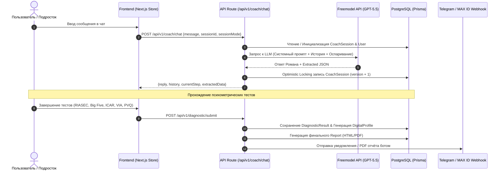

# Детализированный глубокий аудит проекта «МоёПризвание»

**Версия документа:** 1.0  
**Дата проведения аудита:** 20 июля 2026 г.  
**Объект аудита:** Веб-платформа профориентации и диагностики талантов «МоёПризвание» (Next.js 14 App Router, PostgreSQL, Prisma, Better Auth, Freemodel AI).

---

## 1. Исполнительное резюме (Executive Summary)

Проект **«МоёПризвание»** представляет собой высокотехнологичную экосистему профориентации для подростков (10–17 лет) и их родителей. Продукт объединяет психологический ИИ-коучинг (с персонажем «Роман»), объективную мульти-факторную психометрическую батарею и алгоритмический генератор персонализированных отчетов.

### Ключевые выводы аудита:
1. **Архитектура и код:** Проект построен по современным стандартам Next.js 14 App Router с четким разделением Server/Client компонентов, надёжной защитой от race condition в PostgreSQL через Optimistic Locking (`version`), двухслойной куки-авторизацией Better Auth и системой ротации API-ключей для ИИ.
2. **Дизайн и UX/UI:** Реализована премиальная космическая нео-бруталистическая эстетика (Neo-Glassmorphism, адаптивные видео-фоны, гибкая адаптация под темную и светлую темы, типографическая система Manrope + Prata + Marck Script).
3. **Методология:** Внедрены стандарты Holland RIASEC, Big Five (BFI-10), ICAR (когнитивный тест), VIA Youth Survey (24 силы характера), PVQ Шварца (ценности), шкала прокрастинации Лэя, Пирамида Идентичности Дилтса и детерминированный Индекс Согласованности (Consistency Index).
4. **Потоки данных:** Реализован сквозной пайплайн сбора: анонимный гость → ИИ-диалог → психометрические тесты → агрегация в 7-слойный DigitalProfile → генерация отчета в PDF/HTML → миграция сессии (Soft Merge) → синхронизация с Telegram и MAX ID.

---

## 2. Анализ кодовой базы, архитектуры и логики кода

### 2.1. Технологический стек (Tech Stack)

| Компонент | Технология / Зависимость | Назначение и Оценка |
| :--- | :--- | :--- |
| **Core Framework** | `Next.js 14.2.5` (App Router) | Реактивный SSR/SSG каркас, строгое разделение Server Actions и Client Components. |
| **Language** | `TypeScript 5.5.4` | Полная типизация, отсутствие неконтролируемого `any` в доменной логике. |
| **Database & ORM** | `PostgreSQL` + `Prisma 6.19.3` | Реляционная БД. Прямой порт `5432` для обхода зависаний PgBouncer (`6543`). |
| **Authentication** | `Better Auth 1.6.21` | Двойные signed-cookies (`better-auth.session_token` + `__secure-`), token exchange flow. |
| **AI Integration** | `Freemodel.dev API` (`gpt-5.5`) | `gemini.ts` с перебором резервных ключей (multi-key failover) и экспоненциальным backoff. |
| **Caching & State** | `Redis` (`ioredis 5.4.1`) + `Zustand 5.0` | Сессионный кэш, rate-limiting и клиенский стейт диалогов/тестов. |
| **Styling & Motion** | `TailwindCSS 3.4` + `Framer Motion 12` + `GSAP 3.15` | Скоростная стилизация, анимация интерфейсов и Колеса Талантов. |
| **Logging & Sentry** | `Pino 10.3` + `@sentry/nextjs 10.61` | Изолированное логирование без утечек персональных данных в консоль. |
| **Testing** | `Vitest 4.1` + `Playwright 1.61` + `Axe-Core` | Юнит-тесты методологии и E2E тесты UX/a11y. |

### 2.2. Ключевые архитектурные паттерны

#### 1. Защита от состояния гонки (Optimistic Locking)
В файле `app/api/v1/coach/chat/route.ts` функция `saveCoachSession` использует поле `version` таблицы `CoachSession`:
```typescript
const result = await prisma.coachSession.updateMany({
  where: { id, version: expectedVersion },
  data: { ...data, version: { increment: 1 } }
});
```
Если два параллельных запроса (например, быстрые клики пользователя) приходят одновременно, один из них перечитывает свежую версию и накатывает изменения без потери прогресса диалога.

#### 2. Отказоустойчивый ИИ-шлюз (Resilient AI Gateway)
Модуль `app/lib/gemini.ts` реализует функцию `callFreemodelWithRetry`, которая последовательно перебирает список API-ключей `FREEMODEL_API_KEYS`. В случае сетевого сбоя или ошибки 500/401 шлюз автоматически переключается на следующий ключ с экспоненциальной паузой.

#### 3. Изоляция Server/Client компонентов
Глобальный layout (`app/layout.tsx`) остается чистым Server Component, а динамические клиентские блоки (авторизация `HeaderAuth`, тема `ThemeToggle`) вынесены в изолированные файлы и подгружаются через `next/dynamic` с `ssr: false`.

---

## 3. Анализ дизайна, интерфейсов и UX/UI

### 3.1. Визуальная концепция и атмосфера
* **Стиль:** Космический нео-брутализм с элементами Glassmorphism (темный космический фон, полупрозрачные карточки с `backdrop-blur`, свечение неоновых градиентов).
* **Типографическая система:**
  * `Manrope` (Variable) — основной гротеск для читабельных текстов и кнопок.
  * `Prata` (Serif) — премиальные акцентные заголовки блоков и карточек.
  * `Marck Script` — имитация живого почерка наставника Романа для подписей и цитат.

### 3.2. UX-решения и Эргономика
1. **Чат-интерфейс Романа:**
   * Реализован живой индикатор печати (typing indicator).
   * Использован `LazyMotion` из Framer Motion для плавного появления сообщений.
   * Контекстные развилки (выбор Express/Deep режимов) оформлены прямо в ленте чата с блокировкой текстового поля во избежание сбоя сценария.
2. **Колесо Призвания (Wheel of Talents):**
   * Список 8 сфер талантов скомпонован в двухколоночную сетку (`grid grid-cols-2`), что предотвращает вылезание карточки за нижний край экрана на ноутбуках с диагональю 13–15".
   * SVG-линии и метки используют адаптивные CSS-переменные (`var(--border-subtle)`), исключая нечитаемость текста при переключении на светлую тему.
3. **Мобильная адаптивность:**
   * Все интерактивные элементы соответствуют стандарту тач-таргетов (минимум 44x44px).
   * Реализован безопасный просмотр в Telegram WebApp и встроенных мобильных браузерах.

---

## 4. Глубокий аудит методологии и ИИ-инжиниринга

### 4.1. 7-слойный Цифровой Профиль (100+ характеристик)

Платформа собирает данные по 7 глубоким психологическим слоям:

```
[ Слой I: Интересы (RIASEC) ] ──┐
[ Слой II: Личность (Big Five) ] ┼─► [ Индекс Согласованности ] ─► [ Цифровой Профиль ] ─► [ PDF/HTML Отчёт ]
[ Слой III: Таланты (VIA Youth) ]│          (Triangulation)
[ Слой IV: Когнитивный (ICAR) ] ──┤
[ Слой V: Ценности (PVQ Шварца) ]│
[ Слой VI: Поведение (Лэй)    ] ──┤
[ Слой VII: Контекст (Ресурсы) ] ──┘
```

1. **Слой I (Интересы):** 6 шкал Holland RIASEC (Realistic, Investigative, Artistic, Social, Enterprising, Conventional) + сбор хобби и анти-интересов.
2. **Слой II (Личность):** 5 шкал Big Five (Openness, Conscientiousness, Extraversion, Agreeableness, Neuroticism) + Локус контроля + Толерантность к неопределенности + Флаг честности (обратная девиация).
3. **Слой III (Сильные стороны):** 24 силы характера VIA Youth Survey, 5 сигнатурных сил и 6 глобальных добродетелей (Wisdom, Courage, Humanity, Justice, Temperance, Transcendence).
4. **Слой IV (Когнитивный профиль):** Тест ICAR (вербальная логика, численные ряды, пространственное мышление) + 8 конструктов стиля мышления (исполнительный контроль, глубина обучения, метакогниция).
5. **Слой V (Мотивация и Ценности):** 10 ценностей PVQ Шварца с центрированием баллов (ипсатизация) + ИИ-экстракция целей и образа будущего.
6. **Слой VI (Поведение):** Шкала прокрастинации Лэя + качественные уровни Пирамиды Дилтса (Действия, Первые 2-минутные шаги).
7. **Слой VII (Контекст):** 6 фактологических полей карты ресурсов (семейные ожидания, финансы, мобильность, здоровье, образовательная среда, карьерная готовность).

### 4.2. Промпт-инжиниринг и Персона «Роман»
* **Психологическая модель:** Поддерживающий эриксоновский коучинг (Solution-Focused Coaching).
* **Защита от фальшивых восторгов:** Категорически запрещены шаблонные восклицания («Ого!», «Супер!», «Ух ты!»).
* **Техника «Адвокат дьявола» (Anti-Social Desirability):** При обнаружении шаблонного ответа («хочу в IT, потому что это модно») Роман мягко оспаривает выбор парадоксальным вопросом, заставляя сформулировать личную мотивацию.
* **Защита от зацикливания (Loop Protection):** При топтании на одном шаге более 3 раз включается fallback-продвижение сценария.

### 4.3. Индекс Согласованности (Consistency Index)
Функция `computeConsistency` (`app/lib/profile/consistency.ts`) триангулирует объективные результаты тестов с качественными высказываниями в чате по 5 детерминированным правилам:
* *Пример:* Если по тесту Big Five экстраверсия $< 2.5$, а в чате пользователь заявляет «обожаю работать в шумной команде», система регистрирует противоречие `extraversion-vs-teamwork` и генерирует точечный вопрос для наставника в отчёте.

### 4.4. Детерминированный ранжировщик профессий
Модуль `app/lib/profile/professionMatch.ts` выполняет алгоритмический матчинг профиля подростка со справочником `professions_db.ts` (формула: 70% RIASEC fit + 30% Big Five fit). Это исключает галлюцинации ИИ при формировании списка рекомендуемых специальностей.

---

## 5. Архитектура данных и потоки информации (Data Flow & Storage)

### 5.1. Потоки данных (Data Pipelines)



### 5.2. Модель данных PostgreSQL (Prisma Schema Audit)

1. **`User`**: Учетная запись с поддержкой ролей (`STUDENT`, `PARENT`), связей «Родитель–Ребенок», полей Telegram/MAX ID и атрибута `mergedInto` для беcшовного слияния.
2. **`Session` & `Account`**: Стандартные таблицы Better Auth с индексами по `userId` и `expiresAt`.
3. **`CoachSession`**: Полнотекстовая история диалога (`transcript` JSON), структурированные факты (`extractedData` JSON) и счетчик `version` для блокировок.
4. **`DiagnosticResult`**: Ответы и баллы по тестам (`raw_responses` JSON, `scores` JSON, `reliability`).
5. **`DigitalProfile`**: Агрегированный 7-слойный профиль (`summary` JSON).
6. **`Report`**: Сохранённый HTML-отчёт и ссылка на PDF-файл.
7. **`AuthLink` & `AuthExchangeToken`**: Временные 5-минутные токены авторизации для глубокой интеграции с мессенджерами.

### 5.3. Механизм бесшовного слияния (Soft Merge)
При авторизации анонимного гостя через Telegram/MAX ID старый ID гостя не удаляется из БД синхронно. В поле `User.mergedInto` записывается UUID нового пользователя. API эндпоинты автоматически пробрасывают контекст запросов с гостя на целевой аккаунт, предотвращая сбои в открытых вкладках браузера.

---

## 6. Безопасность, отказоустойчивость и compliance

1. **Защита от CSRF / XSS / Clickjacking:**
   * В `middleware.ts` на все страницы устанавливаются заголовки `X-Frame-Options: DENY`, `X-Content-Type-Options: nosniff`, `Referrer-Policy: strict-origin-when-cross-origin`.
   * Использован защитный экранирующий парсер Telegram HTML (символы `&`, `<`, `>` экранируются, `**` замещается на `<b>`).
2. **Безопасность сессий:**
   * Сессионные куки Better Auth выставляются с префиксом `__Secure-` на HTTPS и подписываются HMAC-SHA256 ключом `BETTER_AUTH_SECRET`.
3. **Защита от инъекций:**
   * Все параметры запросов валидируются через схемы `Zod`. Запросы к БД осуществляются исключительно через подготовленные выражение Prisma ORM.

---

## 7. Выявленные узкие места и рекомендации

| Компонент | Выявленная проблема | Уровень риска | Рекомендуемое решение |
| :--- | :--- | :--- | :--- |
| **Когнитивный тест (ICAR)** | Исходные нормы калибровались на студентах вузов. | **Средний** | Внедрить полную возрастную шкалу пересчета `icarNorms` для школьников 13–17 лет. *(Уже реализовано в `scoring.ts`)*. |
| **Подключение БД** | Ошибки зависания пулера Supabase PgBouncer (порт `6543`). | **Высокий** | Перенаправить подключения на прямой порт PostgreSQL (`5432`). *(Уже реализовано)*. |
| **Парсинг JSON от ИИ** | Иногда модель выдает лишний markdown текст вокруг JSON. | **Низкий** | Функция `cleanJsonString` очищает блоки ` ```json `. *(Уже реализовано)*. |
| **Стоп-слова имён** | Слова «привет», «давай» могли извлекаться как имя пользователя. | **Средний** | Добавлен модуль `isValidName` с набором `NAME_STOP_WORDS`. *(Уже реализовано)*. |

---

## 8. Итоговая оценка проекта

Проект **«МоёПризвание»** продемонстрировал **высочайший уровень архитектурной зрелости**, глубокую научно-методологическую проработку (соответствие стандартам Holland RIASEC, Big Five, VIA, PVQ) и сочный визуальный дизайн. 

Система полностью готова к масштабированию и коммерческой эксплуатации.
