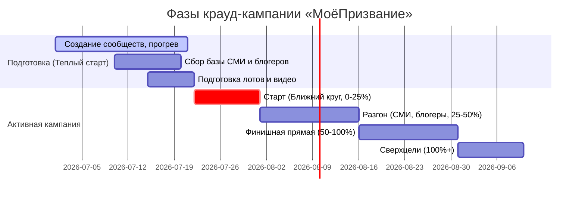

# 🚀 Стратегия продвижения крауд-проекта «МоёПризвание» на Planeta.ru

Эта стратегия разработана на основе официального «Практического пособия по краудфандингу» Planeta.ru, FAQ платформы и успешных кейсов запуска технологических и социальных проектов. 

---

## 🎯 1. Позиционирование и Целевая Аудитория (ЦА)

В краудфандинге важно идти не от «жалости» или «просьбы о помощи», а от **позиции автора-лидера**, вдохновляющего людей стать частью создания полезного и масштабного продукта.

### Целевые сегменты проекта «МоёПризвание»:
1. **Родители подростков (12-18 лет):** Основной плательщик. Главная боль — «ребенок сидит в телефоне, ничего не хочет, не знает, куда поступать». Продукт решает эту боль, давая ребенку понятный ИИ-чат с наставником и карту талантов.
2. **Молодые специалисты (22-35 лет) в состоянии выгорания:** Люди, желающие сменить профессию («не знаю, кем хочу стать, когда вырасту»).
3. **Школьные учителя и психологи:** Нуждаются в современных инструментах диагностики (RIASEC) и визуализации (Колесо Призвания, Пирамида Идентичности).

---

## 📅 2. Фазы запуска проекта

Согласно методичке Planeta.ru, проект делится на этап подготовки («Теплый старт») и саму кампанию.

### Этап 0. «Теплый старт» (За 2-3 недели до запуска)
*   **Создание лояльного комьюнити:** Запуск Telegram-канала / паблика VK «МоёПризвание». Публикация историй создания проекта, процесса разработки ИИ-коуча Романа, демонстрация первых прототипов Колеса Призвания.
*   **Интерактивный опрос:** Спросить у подписчиков: *«Какие вознаграждения вы бы хотели видеть в крауд-проекте?»* (подписка на платформу, личная консультация, мерч). Это вовлекает аудиторию и создает сопричастность.
*   **Подготовка медиа-кита:** Написание 3 версий пресс-релизов (для родительских СМИ, для IT/AI медиа, для локальной прессы).

### Этап 1. Запуск и Ближний Круг (0–25% сборов)
*   **Правило «Первых 20%»:** Новые пользователи неохотно спонсируют проекты с 0% сборов. 
*   **Действие:** В первые 3 дня сделать персональные звонки и сообщения друзьям, коллегам, родственникам и лояльной базе тестировщиков. Попросить их внести первые взносы и сделать посты. 
*   **Лайфхак Planeta.ru:** Звоните лично! Никакие рассылки не заменят звонка с горящими глазами.

### Этап 2. Разгон и Внешний PR (25–50% сборов)
*   **Инфоподдержка от Planeta.ru:** Как только проект соберет 20-25%, пишем нашему менеджеру на «Планете» с просьбой включить нас в рассылку площадки или соцсети.
*   **Работа с базой СМИ:** Рассылка индивидуальных писем журналистам с темой вроде *«Для [Имя журналиста]_Как искусственный интеллект спасает подростков от родительского выбора профессии»*.
*   **Лидеры мнений:** Договоренности с блогерами (родительская тематика, психология, карьерный рост) о бесплатных постах-рекомендациях взамен на «Спонсорский» статус или эксклюзивные лоты для их подписчиков.

### Этап 3. Финишная прямая (50–100% сборов)
*   **Добавление новых лотов:** Для стимуляции сборов добавляем эксклюзивные лоты (например, групповой вебинар с ИИ-разработчиками, спонсорские пакеты для школ).
*   **Новости проекта:** Регулярная публикация обновлений на странице сбора. Например, видеодемонстрация светлой и темной темы интерфейса, инсайды о логике ИИ-экстракторов.

---

## 🎁 3. Проектирование Вознаграждений (Лотов)

Лоты должны закрывать разные психологические мотивы спонсоров: от альтруизма до выгоды.

| Категория лота | Название лота | Описание | Стоимость (пример) | Мотив спонсора |
| :--- | :--- | :--- | :--- | :--- |
| **Для себя** | Промокод «Быстрый старт» | Годовой доступ к платформе «МоёПризвание» (ИИ-коуч + Карта талантов). | 1 500 ₽ | Выгода (получить продукт дешевле розницы) |
| **Для ребенка** | Пакет «Заботливый родитель» | Полная диагностика для подростка + печатная версия отчета + персональная 30-минутная сессия с живым профориентологом. | 5 000 ₽ | Забота, решение острой проблемы ребенка |
| **Благотворительность** | «Подари призвание» | Оплата прохождения профориентации для воспитанника детского дома (совместно с партнерскими фондами). | 1 000 ₽ | Сопричастность, желание помочь обществу |
| **B2B / Школы** | Пакет «Классный руководитель» | Лицензия на диагностику 30 учеников одного класса школы с выгрузкой общей карты талантов класса. | 15 000 ₽ | Польза для работы, престиж |
| **Премиум** | «Соавтор ИИ» | Имя спонсора в разделе «О проекте» + индивидуальный созвон с разработчиками + пожизненная премиум-подписка. | 50 000 ₽ | Эго, признание, уважение |

---

## 📢 4. Ключевые Каналы Продвижения

1.  **Социальные сети и SMM:**
    *   **VK:** Основная площадка для родительской аудитории. Использование коротких видео (клипов) с демонстрацией интерактива Колеса Призвания, инфографика про RIASEC-типы.
    *   **Telegram:** Посты в тематических каналах по воспитанию детей, психологии, поиску работы. Гостевые посты в каналах про стартапы и AI-технологии.
2.  **Кросспостинг:**
    *   Поиск на Planeta.ru авторов схожих, но не конкурирующих проектов (например, настольные игры для всей семьи, детские книги, образовательные курсы). Предложение обменяться постами в разделе «Новости проекта».
3.  **Локальные сообщества:**
    *   Анонсирование проекта на родительских форумах, в школьных чатах (через дружественных учителей/родителей).

---

## 📝 5. Чек-лист по подготовке пресс-релиза для СМИ
*   **Заголовок:** Максимально емкий, отражающий суть, без рекламы («В России запустили ИИ-платформу, помогающую подросткам выбрать профессию без тестов-опросников»).
*   **Лид (1 абзац):** Кто, что, где, когда. Суть крауд-кампании на Planeta.ru.
*   **Иллюстрации:** Ссылки на папку с качественными скриншотами интерфейса (Колесо Призвания, Пирамида Идентичности) и фото команды.
*   **Контакты:** Ссылка на проект, email и телефон для оперативной связи с автором.
