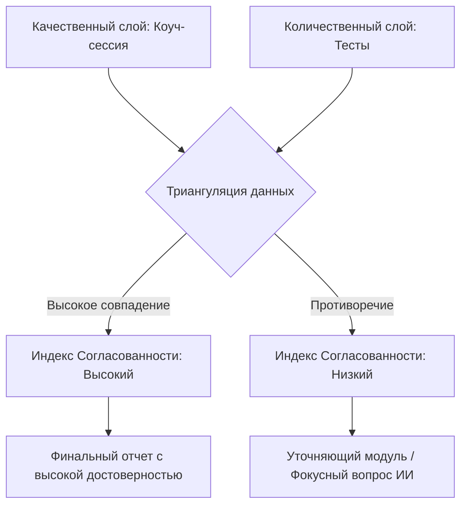

# Расширенный методологический аудит проекта «МоёПризвание»

Этот документ является результатом глубокого анализа методологии профориентационного проекта «МоёПризвание». Он интегрирует данные из кодовой базы, методологического паспорта и детализированного перечня **100 характеристик цифрового профиля**, сопоставляя их с лучшими мировыми практиками работы с подростками (10–17 лет).

---

## 1. Архитектура цифрового профиля: 7 слоев (100 характеристик)

Цифровой профиль строится на основе сопоставления качественных данных (коуч-сессия Романа) и количественных данных (диагностические тесты). В таблице ниже представлена полная 7-слойная структура из 100 параметров, определен метод их сбора и статус покрытия в текущей версии (MVP) по сравнению с целевой моделью (v2).

| Слой профиля | Характеристики (всего 100) | Метод сбора (MVP) | Метод сбора (v2 / Целевой) | Покрытие |
| :--- | :--- | :--- | :--- | :--- |
| **I. Интересы и Склонности** *(10 параметров)* | 1-6. Типы по RIASEC 7. Предметные области (IT, медицина и др.) 8. Формат деятельности (люди/данные/вещи/идеи) 9. Внеучебная активность (хобби) 10. Анти-интересы | Тест RIASEC (12 вопр.), Коуч-сессия (свободный ввод) | **O*NET Interest Profiler** (24 вопр.), Адаптивный ИИ-скрининг хобби | **10 / 10** (в MVP собраны базовые векторы) |
| **II. Личность и Трейты** *(15 параметров)* | 11-15. Шкалы Big Five (OCEAN) 16. Локус контроля 17. Самооценка 18. Рискованность 19. Честность перед собой 20. Толерантность к двусмысленности 21-25. Темперамент (реактивность, темп, пластичность, эмоциональная возбудимость, сензитивность) | Тест BFI-10 (10 вопр.), Коуч-сессия (ограничения) | Стандартизированный BFI-2 (30 вопр.), Игровая поведенческая проба | **8 / 15** (требуется расширение шкал темперамента) |
| **III. Сильные стороны и Таланты** *(24 параметра)* | 26-29. Мудрость (креативность, любознательность и др.) 30-32. Мужество (смелость, честность и др.) 33-35. Человечность (доброта, соц. интеллект) 36-38. Справедливость (лидерство, командность) 39-42. Умеренность (саморегуляция и др.) 43-49. Трансцендентность (юмор, надежда, благодарность) | *Не оценивается количественно* (только качественный вывод ИИ) | **VIA Youth Survey** (24 или 96 вопросов) | **0 / 24** (в MVP нет тестов на таланты, только ИИ-гипотезы) |
| **IV. Когнитивный профиль** *(15 параметров)* | 50. Общий интеллект (g-factor) 51. Вербальный интеллект 52. Математическая логика 53. Пространственное мышление 54. Скорость обработки информации 55. Рабочая память 56. Концентрация внимания 57. Критическое мышление 58. Креативность (дивергентное) 59. Системное мышление 60. Способность к языкам 61. Алгоритмическое мышление 62. Обучаемость (Fluid Intelligence) 63. Помехоустойчивость внимания 64. Гибкость мышления (переключаемость) | Тест ICAR (3 вопр. на вербальную логику и ряды) | Расширенная когнитивная батарея ICAR (6-8 вопр.) + когнитивные игровые пробы | **3 / 15** (критический разрыв в пространственных способностях) |
| **V. Мотивация и Ценности** *(10 параметров)* | 65. Ведущий архетип (глубинная роль) 66. Внутренняя vs Внешняя мотивация 67. Мотивация достижения vs Избегания неудач 68. Ценность автономии 69. Ценность власти/влияния 70. Ценность безопасности 71. Ценность помощи другим 72. Денежная мотивация 73. Потребность в признании 74. Смысловая нагрузка труда | Вывод ИИ в конце коуч-сессии (шаг 16) | Тест **PVQ Шварца** (адаптированный) + ИИ-экстракция | **5 / 10** (оценка ценностей носит качественный характер) |
| **VI. Поведенческие маркеры и Hard Skills** *(15 параметров)* | 75. Уровень прокрастинации 76. Тайм-менеджмент 77. Стиль принятия решений 78. Поведение в конфликте 79. Цифровая грамотность 80. Финансовая грамотность 81. Навык публичных выступлений 82. Навык командной работы 83. Стрессоустойчивость в моменте 84. Дисциплина 85. Навык самопрезентации 86. Адаптивность 87. Эмпатия 88. Навык письменной коммуникации 89. Лидерская позиция | Тест прокрастинации Лэя (4 вопр.), Коуч-сессия (принятие решений) | Шкала Лэя (10 вопр.), Кейс-тесты (ситуационные задачи) | **4 / 15** (не хватает объективной оценки Hard/Soft skills) |
| **VII. Контекст и Ограничения** *(11 параметров)* | 90. Семейные ожидания (давление) 91. Финансовые возможности семьи 92. Географическая мобильность 93. Состояние здоровья (противопоказания) 94. Школьная успеваемость (объективная) 95. Ролевые модели (кумиры) 96. Ограничивающие убеждения («я не смогу») 97. Fixed vs Growth Mindset 98. Доступная образовательная среда 99. Социальный капитал (связи) 100. Карьерная зрелость | Коуч-сессия (извлечение города, класса, кумиров, страхов) | Углубленный ИИ-анализ контекста с участием родителей | **8 / 11** (качественно контекст собирается хорошо) |

---

## 2. Методологический аудит коуч-сессии

### 2.1. Соответствие мировым методикам
1.  **Эриксоновский подход (Solution-Focused Coaching)**: Идеально подходит для подростков 10-17 лет. Он снимает иерархическое давление «взрослый-ребенок», переводя общение в партнерский формат. Акцент на будущем и целях («чего ты хочешь достичь?») исключает терапевтическое копание в прошлых неудачах, снижая уровень тревожности.
2.  **Пирамида Дилтса (Логические уровни)**: Оправданный драматургический сценарий. Однако в современной подростковой профориентации акцент смещается на **Narrative Coaching (Нарративный коучинг)**. Важно не просто измерить уровни «окружение» или «ценности», а проанализировать, *какую историю* подросток рассказывает о себе (какие слова использует, считает ли себя автором своей жизни).
3.  **State Machine (Шаги диалога)**: Логика линейного продвижения от знакомства к целям, ценностям и итогам верна.

### 2.2. Выявленные проблемы коуч-сессии и их решения

> [!WARNING]
> **Проблема социально желаемых ответов**: Подростки склонны давать шаблоны и «правильные» ответы («я люблю физику», «в свободное время я читаю книги»), чтобы быстрее пройти диалог или соответствовать ожиданиям родителей.

*   **Решение**: В блок сбора ограничивающих убеждений (`LIMITING_BELIEFS` или шаг страхов/барьеров в коде) необходимо интегрировать техники **«Адвокат дьявола»** или **«Парадоксальное интенсирование»**.
    *   *Как реализовать*: Если подросток говорит: «Я хочу быть программистом, потому что это круто», ИИ-коуч Роман не должен соглашаться. Он должен мягко оспорить: «А что если завтра алгоритмы будут писать код сами? Зачем тогда учиться программировать?» Это заставляет подростка формулировать истинную мотивацию и снимает фасад социальной желательности.
*   **Стык с тестами (Синхронизация в реальном времени)**: 
    *   *Проблема*: Сейчас коуч-сессия и тестирование изолированы. Коуч завершает работу, передает качественные данные, и только затем запускаются тесты.
    *   *Решение*: Настроить взаимосвязь. Если подросток прошел коуч-сессию, а затем в тестах его показатели противоречат диалогу (например, на коуч-сессии он заявлял, что обожает общение, а в тесте Big Five шкала *Экстраверсия* оказалась на уровне 15%), система должна сгенерировать дополнительный уточняющий вопрос от Романа в отчете или в чате: *«Интересно! В разговоре ты упомянул, что обожаешь командную работу, но тест показывает, что тебе комфортнее в тишине наедине с собой. Как эти две суперсилы уживаются в тебе?»* Это создает вау-эффект и повышает глубину осознания.

---

## 3. Методологический аудит диагностической батареи

### 3.1. Анализ текущих инструментов
1.  **ДДО Климова (RIASEC)**: Климов — классика советской психологии, но методологически устарел (делит мир на «человек-техника», «человек-природа» и т.д., что не отражает современную гибридную экономику). RIASEC Холланда — мировой стандарт.
    *   *Рекомендация*: Перейти на адаптированную версию **O*NET Interest Profiler**, так как его 3-буквенные коды напрямую сопоставляются с международной базой профессий O*NET.
2.  **Big Five (BFI-10)**: Лучший мировой инструмент измерения личности. Выбор полностью оправдан.
3.  **ICAR (Когнитивный тест)**: Идея отличная, но в MVP используются всего 3 вопроса на логику и силлогизмы. 
    *   *Критическая оговорка*: Исходно ICAR калибровался на студентах вузов. Без адаптации норм для школьников 13-17 лет тест будет выдавать заниженные когнитивные баллы, что демотивирует подростка и сформирует синдром самозванца.
4.  **Архетипы Юнга**: Самая ненаучная часть тестов. Полноценного опросника в коде нет, оценка идет качественно силами ИИ.
    *   *Рекомендация*: Заменить архетипы Юнга на **VIA Youth Survey** — признанный в позитивной психологии инструмент оценки 24 сильных сторон характера.

---

## 4. Концепция триангуляции и сопряжения данных

Главный методологический вызов проекта — соединить качественные данные диалога с количественными результатами тестов.

### Внедрение «Индекса согласованности» (Consistency Index)
Необходимо разработать алгоритм сравнения:
*   Сравнить ведущий RIASEC-код из теста с `talentScores` коуча.
*   Сравнить уровень общительности по Big Five с командной ролью, названной коучу.
*   Если данные согласуются $\rightarrow$ выдается отчет с пометкой «Высокая достоверность».
*   Если данные расходятся (например, низкая добросовестность по тесту при заявлениях коучу о железной дисциплине) $\rightarrow$ «Индекс согласованности» снижается, а ИИ-генератор отчета добавляет специальный раздел **«Внутренние противоречия — твои скрытые ресурсы»**.

---

## 5. Игровая упаковка методологии (Геймификация)

Для преодоления подросткового сопротивления и скуки методология прохождения должна быть упакована в цельный нарратив:

1.  **Коуч-сессия с Романом $\rightarrow$ «Диалог с Наставником / Хранителем»**: Вводная часть игры, где подросток определяет свой аватар и заявляет свои цели («контрактирование»).
2.  **Блок Big Five $\rightarrow$ «Настройка характеристик персонажа»**: Интерактивное распределение черт характера.
3.  **Блок ICAR $\rightarrow$ «Взлом системы / Когнитивный хакинг»**: Позиционирование когнитивных задач как интеллектуального вызова или мини-квеста, а не проверки знаний.
4.  **Блок VIA Youth $\rightarrow$ «Сборка артефактов силы»**: Определение уникальных качеств характера как игровых суперсил.

---

## 6. От Профессий к Навыкам (Skills-Based Recommendations)

Мировой рынок труда отказывается от жестких профессиональных ярлыков. Профессии быстро трансформируются.
*   **Новый подход**: Вместо рекомендации конкретной должности (например, `UX/UI-дизайнер`) система должна делать упор на **карту компетенций (Skills-based)**.
*   **Пример в отчете**:
    *   *«Твоя формула успеха: Аналитическое мышление + Эмпатия + Алгоритмика»*.
    *   *Где применить*: Разработка интерфейсов, продуктовый менеджмент, биоинформатика, социальный инжиниринг.
    Это дает подростку гибкость: если одна сфера автоматизируется, его базовые навыки позволят ему легко переориентироваться.

---

## Чек-лист конкретных улучшений для реализации

### В коуч-сессиях:
*   [ ] Сократить Express-сценарий коуча до 8 ключевых блоков для снижения утомляемости.
*   [ ] Внедрить в промпт коуча приемы «Адвоката дьявола» при сборе ограничивающих убеждений.
*   [ ] Реализовать проверку противоречий диалога и тестов в финальном отчете.

### В тестировании:
*   [ ] Интегрировать 24 вопроса **VIA Youth Survey** для оценки сильных сторон характера.
*   [ ] Заменить 12 вопросов RIASEC на 24 вопроса адаптированного **O*NET Interest Profiler**.
*   [ ] Расширить когнитивный тест **ICAR** с 3 до 6 вопросов, включив пространственные и визуальные матрицы, и откалибровать шкалу оценки под возрастную норму 13-17 лет.
*   [ ] Создать жесткий алгоритмический фильтр O*NET профессий на бэкенде вместо прямой ИИ-генерации.
